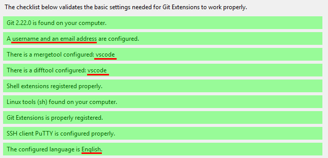
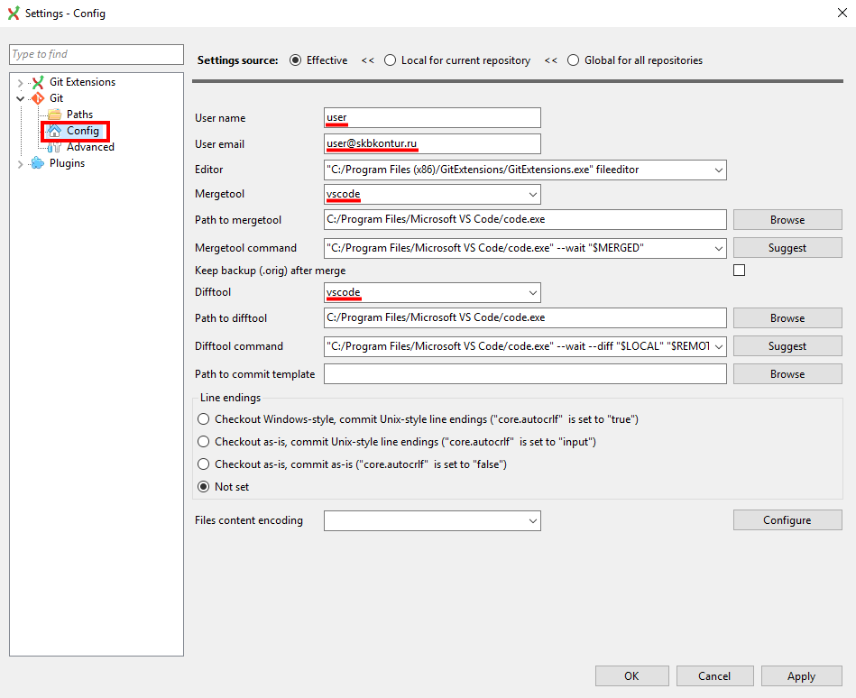

# Подготовка для варианта с Git Extensions

## Git

Скачать [тут](https://git-scm.com/downloads)

*В инсталляторе оставить все опции по умолчанию*

## VS Code 

Скачать [тут](https://code.visualstudio.com/Download)

*В инсталляторе прожать все галочки в Other*

(Опционально) Включи автосохранение в VS Code - больше не придется нажимать `Ctrl/Cmd + S` после каждого изменения. Ставим галочку `Auto Save` в меню  `File`

## Git Extensions

Скачать [тут](https://gitextensions.github.io/)

*В инсталляторе оставить все опции по умолчанию*

1. Запусти Git Extensions. Выбери английский язык для интерфейса

2. При старте откроется мастер. Убедись, что все зеленое:

3. Если не зеленое, то донастрой:

## Настройка Git

1. Отрой консоль. Выполни `git config -e --global`, чтобы открыть настройки в редакторе.
2. Скопируй настройки [отсюда](https://github.com/kontur-courses/git/blob/master/config/global/.gitconfig).
3. Убедись, что путь до VS Code верный (VS Code может быть установлен для всех пользователей или для конкретного пользователя)

## GitHub

[Заведи аккаунт на GitHub](https://github.com/join)

## SSH для GitHub (опционально)

1. Сгенерируй ssh-ключ. Для этого в терминале (Git Bash на Windows) введи:

   `ssh-keygen -t rsa -b 4096`

   Оставь все опции по умолчанию (`Enter` после каждого вопроса)
   После этого в директории `~/.ssh` будет создано 2 файла: `id_rsa` и `id_rsa.pub`

2. Теперь нужно добавить содержимое `id_rsa.pub` на GitHub. Просмотреть его можно, например, открыв через VS Code: 

   `code ~/.ssh/id_rsa.pub`

   Его нужно вставить на этой странице в поле "Key"

   <https://github.com/settings/ssh/new> 
   
   В поле "Title" можно написать что угодно, это просто название ssh-ключа.
   
   После этого нажми `Add SSH key` и ключ будет добавлен

